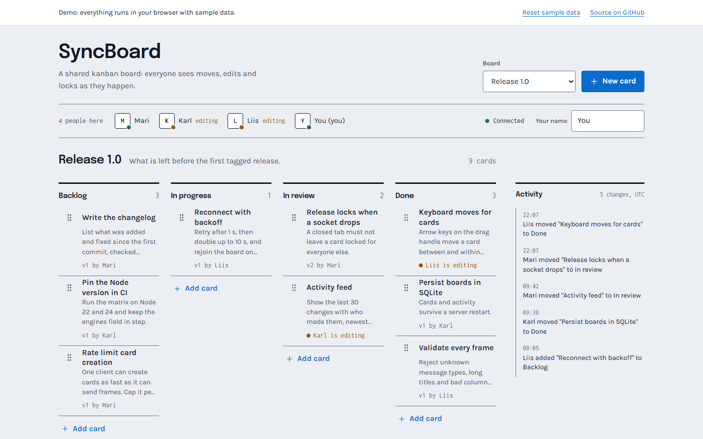

# SyncBoard

SyncBoard is a real-time kanban board. People open the same board, drag cards between columns, edit them, and see each other's moves, edits and locks as they happen over a WebSocket. Boards, cards and the activity feed are stored in SQLite, so they survive a server restart. It suits small teams who want a shared board they can host themselves with one Node process.

[](https://github.com/Taan1el/syncboard/actions/workflows/ci.yml)
[](https://github.com/Taan1el/syncboard/actions/workflows/pages.yml)
[](LICENSE)

**Live demo:** https://taan1el.github.io/syncboard/

The demo runs entirely in your browser. The same room logic the server uses (`shared/hub.ts`) runs in the page, with three scripted collaborators (Mari, Karl and Liis) who lock, move and release cards every few seconds. Nothing is sent anywhere, and "Reset sample data" restores the starting board.

## Screenshots



More: [the edit dialog while a collaborator holds another card](docs/screenshots/02-edit-card.png) and [the board at phone width](docs/screenshots/04-mobile.png).

The board comes first. Each column is a flat list under a heavy ink rule, cards are plain rows separated by hairlines with a visible drag handle, a presence strip under the header lists who is on the board, and the activity feed sits in a slim right rail that folds into a toggle on narrow screens.

## Features

- **Four columns** (Backlog, In progress, In review, Done) per board, with cards that have a title and details.
- **Drag and drop or keyboard**: drag a row, or focus its handle and press the arrow keys. Up and down reorder, left and right change column. The edit dialog also has a column select for touch screens.
- **Presence**: a strip shows who is on the board and who has a card open.
- **Card locks**: opening a card for editing locks it for everyone else until you save, cancel or disconnect.
- **Activity feed**: the last 30 changes with who made them, newest first.
- **Reconnect with backoff**: after a dropped connection the client retries after 1 s, 2 s, 4 s, 8 s and then every 10 s, and rejoins the board each time.
- **Persistence**: SQLite in WAL mode; cards, positions and activity survive restarts.
- **REST API** for listing boards, cards and activity and for creating boards and cards.
- **GitHub Pages demo mode** with deterministic starting data.

## Getting started

### Prerequisites
- Node.js 22.13 or newer (the server uses the built-in `node:sqlite` module, which is still marked experimental)
- npm 10 or newer

### Install
```bash
git clone https://github.com/Taan1el/syncboard.git
cd syncboard
npm install
```

### Run
```bash
npm run dev
```
This starts the server on port 4000 and the Vite dev server on port 5173. Open **http://localhost:5173**. Open it in two windows to see changes appear in both.

### Run a production build
```bash
npm run build
npm start
```
The server serves the built client from `client/dist` and the WebSocket at `/ws`, all on port 4000.

### Environment variables
Nothing is required for the defaults above. See `server/.env.example` and `client/.env.example`.

| Variable | Used by | Default | Purpose |
|---|---|---|---|
| `PORT` | server | `4000` | Port for HTTP and WebSocket. |
| `SYNCBOARD_DB` | server | `data/syncboard.db` under the working directory | SQLite file. `data/` and `*.db` are git-ignored. |
| `CLIENT_DIST` | server | `client/dist` | Directory with the built client. |
| `VITE_API_TARGET` | client (dev only) | `http://localhost:4000` | Where the Vite dev server proxies `/api` and `/ws`. |

## Scripts

| Script | What it does |
|---|---|
| `npm run dev` | Server (with `tsx watch`) and Vite dev server together. |
| `npm run build` | Compiles the server to `server/dist` and builds the client to `client/dist`. |
| `npm start` | Runs the compiled server. |
| `npm run build:pages` | Builds the client in demo mode with the `/syncboard/` base path. |
| `npm run lint` | Type-checks server and client. |
| `npm test` | Runs the server and client test suites. |

## How it works

```
browser --ws /ws--> WebSocketService --> Hub --> SqliteStore --> data/syncboard.db
browser --REST-----> Express routes   --> Hub.run
demo page ---------------------------> Hub --> MemoryStore   (same Hub, no network)
```

- **Hub** (`shared/hub.ts`) holds the room logic and does no I/O: who is on which board, who holds which lock, and what each operation turns into. Feed it a frame and it returns the frames to send and to whom.
- **Board rules** (`shared/board.ts`) apply one operation to the cards of a board: create, move, update, lock, unlock, delete. The client reuses the same function to apply what the server broadcasts.
- **Validation** (`shared/validate.ts`) turns untrusted frames into typed messages or a readable error.
- **Stores**: `SqliteStore` runs one transaction per operation; `MemoryStore` serves the demo and the tests.

### Sync model

- **Order**: operations are applied in the order the server receives them and broadcast to everyone on the board, including the sender. The sender applies its own move optimistically and applies the confirmation again later, which changes nothing.
- **Conflicts**: there is no version check. If two people move or edit the same card, the later write wins. The card's `version` becomes `max(stored, sent) + 1` and is shown for information only. The only thing that rejects an operation is another person's lock; the sender gets an error message and a fresh copy of the board.
- **Locks**: opening a card sends a lock. Saving, cancelling, deleting or disconnecting releases it. A connection that goes silent is closed after 45 seconds (clients send a heartbeat every 15), which releases its locks.
- **Reconnects**: the client retries with backoff and rejoins the board, then takes the server's state. Changes made while disconnected are not queued; frames sent while the socket is closed are dropped.
- **Restarts**: cards, positions and activity are in SQLite. Presence and locks are in memory and every lock is cleared when the server starts.
- **Text edits** are whole-field replacements. Two people cannot merge edits to the same card; the lock exists so that does not happen by accident.

### Project layout

```
shared/            Types, validation, board rules, Hub, MemoryStore, sample data, collaborator script
server/src/        Express app, WebSocket service, SQLite schema and store, REST controller
server/test/       API, rules, hub, persistence and live WebSocket tests
client/src/        App, components, services (WebSocket and demo), lib (state, moves, formatting)
client/src/test/   Component, reducer, helper and reconnect tests
docs/adr/          Decision records
```

## API reference

Responses are `{ "success": true, "data": ... }` or `{ "success": false, "error": "..." }`.

| Method | Path | Description |
|---|---|---|
| `GET` | `/api/health` | Health check. |
| `GET` | `/api/boards` | List boards. |
| `POST` | `/api/boards` | Create a board. Body: `title`, optional `description`. |
| `GET` | `/api/boards/:id` | One board, `404` if unknown. |
| `GET` | `/api/boards/:id/cards` | Cards of a board. |
| `POST` | `/api/boards/:id/cards` | Create a card. Body: `title`, optional `content`, `column` (default `backlog`) and `updated_by` (default `API`). Connected clients see it immediately. |
| `GET` | `/api/boards/:id/activity` | Recent changes, newest first. Optional `limit` (1 to 100, default 30). |
| `GET` | `/api/metrics` | Board count, card count, open connections and total recorded changes. |

### WebSocket frames (`/ws`)

Client to server:

| `type` | Fields |
|---|---|
| `join_board` | `board_id`, `user_name`, `color` |
| `card_create` | `title`, `content`, `column` |
| `card_move` | `id`, `column`, `index`, `version` |
| `card_update` | `id`, `title`, `content`, `version` |
| `card_lock`, `card_unlock`, `card_delete` | `id` |
| `heartbeat` | none |

Server to client: `board_sync` (board, cards, presences, activity, your client id and name), `presence_update`, `card_created`, `card_moved`, `card_updated`, `card_locked`, `card_unlocked`, `card_deleted`, `activity` and `error`. Titles are limited to 120 characters, details to 2000 and names to 40. If a requested name is taken on the board, the server adds a number.

## Testing

```bash
npm test
```

The server suite (89 tests) covers the board rules and their edge cases, frame validation, the hub, the REST routes, SQLite persistence across a restart and live WebSocket sessions. The client suite (31 tests) uses React Testing Library with fake timers for the key flows (adding, editing, moving, locking, deleting, switching boards, resetting the demo, error and reconnect handling), plus the reducer, the move planning and the reconnect backoff. No test sleeps for real time.

## Deployment

### Docker
```bash
docker compose up --build
```
Open http://localhost:4000. The image builds the client and the server, serves the client from the same process, and keeps the database in the `syncboard-data` volume at `/app/data`. CI builds the image on every push to `main`.

### GitHub Pages
`.github/workflows/pages.yml` builds `npm run build:pages` and deploys `client/dist`. The deploy job only runs when the repository is public.

## Design notes and limitations

- Type is Epilogue for headings, Karla for text and Inconsolata for numbers, all self-hosted. One blue accent; green and amber appear only as status dots and labels. No gradients and no shadows except on the dialog and the message toast.
- The server is a single process. Presence and locks live in its memory, so running several instances behind a load balancer would need a shared bus that is not built.
- There is no authentication. Anyone who can reach the server can join any board under any name.
- Last write wins. There is no undo, and no merging of text edits.
- The `node:sqlite` module is experimental in Node 22 and 24.
- Boards cannot be created from the interface, only through the API.
- Touch screens cannot drag rows (HTML drag and drop does not fire for touch); they use the column select in the edit dialog.
- The activity feed keeps the last 30 entries in view and shows times in UTC.

## Roadmap

- Create and rename boards from the interface.
- Touch-friendly dragging.
- Optional access token for the server.
- Queue edits made while offline and replay them on reconnect.

## License

MIT, see [LICENSE](LICENSE).
